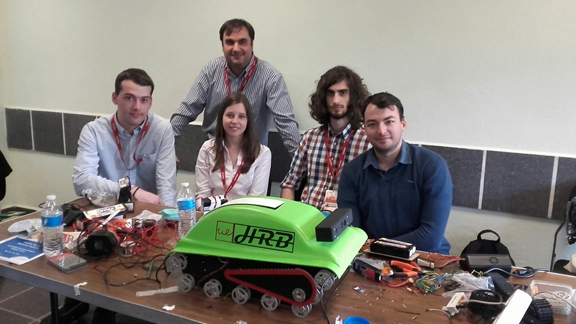

# Human Rescue Bot
### Universidad Europea de Madrid Team
### Laureate Awards for Excellence in Engineering 2016

## 1st Place winners!

## Hardware
* Mini-ITX Skylake based PC
* Arduino Due
* Arduino Mega
* FLiR Lepton
* Microsoft Kinect v1

## Software
### ./Arduino
These two programs must be loaded into the arduinos. The Arduino Due is in charge of recieving thermal images from the FLiR, while the Arduino Mega controls the motors and servos.

### ./client
Python script to control the robot and two ffmpeg scripts to recieve the streams from the camera. A Sony PS3 controller must be plugged in in order for it to work. FFMPEG must be installed to recieve the streams.

### ./server
These scripts must run from the robot's PC. They are usually initiated automatically.

### ROS
ROS was used to create real time 3D maps of indoor environments. We used Ubuntu 14.04 with ROS Indigo and RTAB-Map. You must set ROS_MASTER_URI and ROS_IP to the correct ip's and run rviz. Mapping will be done server side (the robot).
